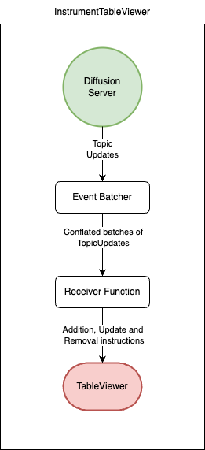
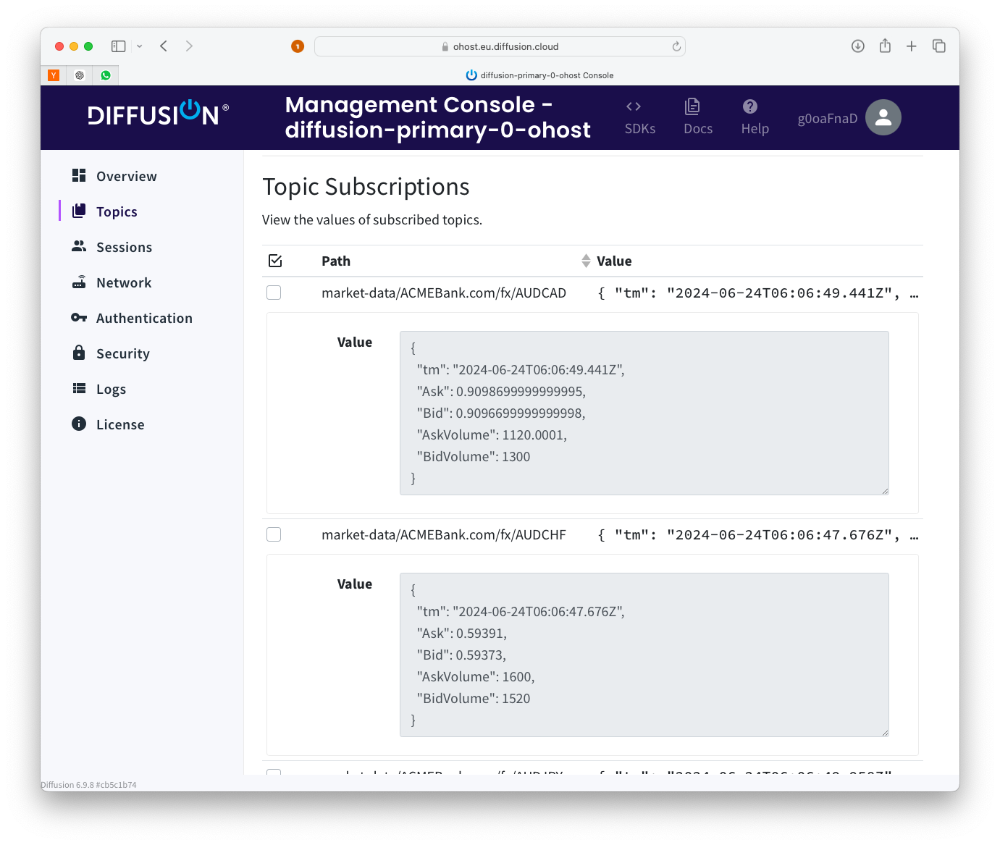
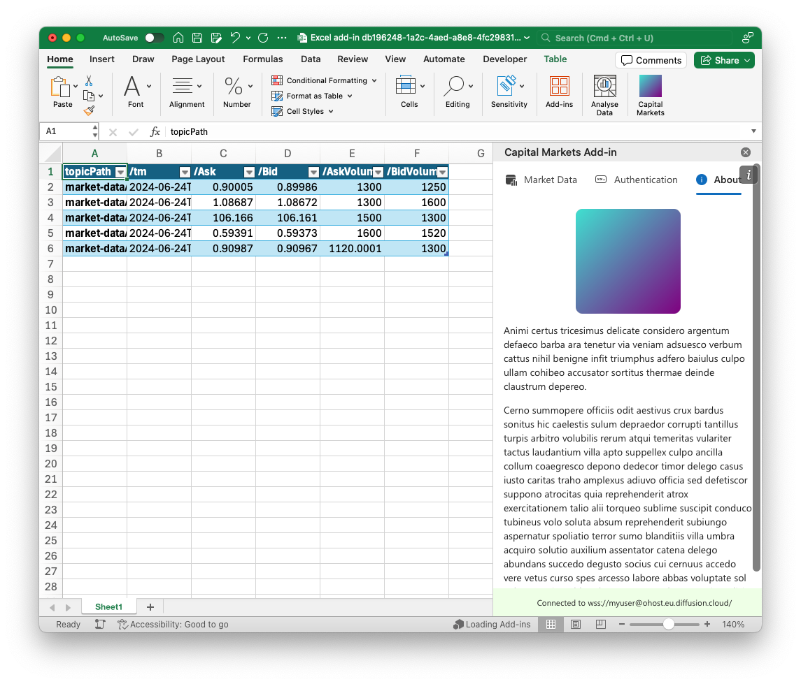
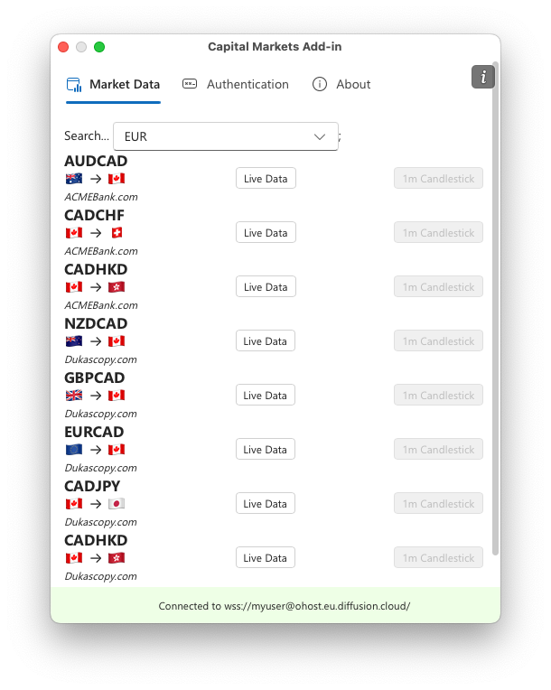
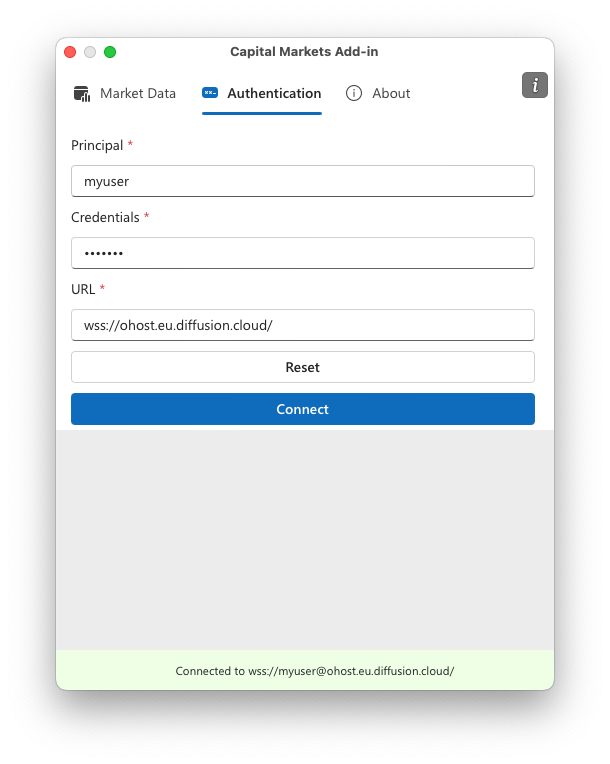

# Capital Markets Add-in demo

This is a minimal example implementation of an [MS Office Add-In](https://learn.microsoft.com/en-us/office/dev/add-ins/overview/office-add-ins) for Excel, integrating with [Diffusion](https://diffusiondata.com) to stream live market data into an Excel table.

The Add-In makes use of [React](https://reactjs.org/), [Fluent UI](https://developer.microsoft.com/en-us/fluentui#/), [office.js](https://learn.microsoft.com/en-us/office/dev/add-ins/develop/understanding-the-javascript-api-for-office) , and the [JavaScript Diffusion SDK](https://docs.diffusiondata.com/docs/latest/js/). It is written in TypeScript and uses [Vite](https://vitejs.dev) for bundling.

Live data flow
--------------



`InstrumentTableView` encapsulates the streaming of live data from Diffusion to Excel and is written to prevent the streaming of live data faster than Excel can recalculate, which would rendering Excel unresponsive to user input.

In broad terms, it receives topic updates from Diffusion and delivers them to an `EventBatcher` to coalesce streams of updates into update batches. Batches are passed to the receiver function which categorizes updates into topic additions, updates, and removals, and then passes them to the `TableViewer`.

### EventBatcher

This class coalesces the stream of topic updates and delivers them as batches to an EventBatchReceiver function. A batch is delivered when its `ready` promise resolves and no current call to the receiver is ongoing. A batch becomes ready when the number of events exceeds a threshold or a timeout is reached. This logic ensures that Excel is not overwhelmed.

**Scenario**: The EventBatcher is configured with a batch size of 1,000 and a timeout of 100ms. A single update arrives for topic `some/topic`. After 100ms, a batch holding the topic update is delivered to the receiver.

**Scenario**: The EventBatcher is configured with a batch size of 1,000 and a timeout of 100ms. 1,001 updates arrive for topic `some/topic`. As soon as 1,000 updates are received, a batch holding the first 1,000 updates is delivered to the receiver, which completes immediately. After 100ms, the second batch is delivered, containing the remaining single update.

**Scenario**: More realistically, the EventBatcher is configured with a batch size of 1,000 and a timeout of 100ms. 1,000 updates arrive from a broad set of unique topics. The EventBatcher delivers the batch of 1,000 topic updates to the receiver, which ultimately waits for Excel while it recalculates a complex Excel table.  
In the meantime, the EventBatcher receives further updates which it coalesces into a second batch. The second batch is delivered to the receiver function once the promise of the prior call is resolved.

### TableViewer

The `TableViewer` class encapsulates an{" "} `Excel.Table` object and layers atop functionality so developers can interact with the table in terms of topic updates, instead of rows and columns. Row locations are indexed optimistically and rebuilt when the table is reordered.

While the TableViewer is updating its content and all dependent Excel formulas are recalculating, the `EventBatcher` continues to receive and coalesce updates from Diffusion.

## Preparation

Use `git clone` to get a local copy of this repo. 

Ensure you have a recent version of `npm`, e.g. on macOS run `brew update; brew upgrade`. 

```
npm install
```

## Configure Diffusion URL and credentials

Open `./src/taskpane/modules/AuthDefaults.ts` and edit to reflect your own environment. 

As Office.js mandates secure HTTP and WebSockets we suggest creating a free Diffusion Cloud instance, which is automatically configured for SSL/TLS. If you wish to use a locally hosted Diffusion instance ensure that your host is [configured to trust its self signed certificate](https://tosbourn.com/getting-os-x-to-trust-self-signed-ssl-certificates/) or the Add-in will be unable to connect. 

## Execution of the data loaders

24 hours of test data is available for demonstration and test purposes. It comprises 2 data sources, covering 54 FX currency pairs, creating 126 discrete topics with a topic path prefix `market-data/`

```
cd testing/fx-loader && npm run load
```

This will connect to your configured Diffusion server and re-play the data in real time. Open the Diffusion console to observe
and subscribe to the data and observe the data is changing.



## Execution of the Office Add-in

Office add-ins are web apps, requiring a web server.

To start the development server, run:

```
npm run dev
```

Open a new shell and load the add-in into your Excel instance: use the `start` script. e.g:

```
npm run start
```

## Usage

Once Excel has begun the add-in will appear on the right hand side.

The task pane can be 'torn off' the main
Excel window to float above as a child window. It can be closed, and resumed using the "Capital Markets" icon in the main Excel ribbon.



### Market Data Tab

The user can stream live data into an Excel table using the `Capital Data` tab. Enter a symbol or symbol fragment e.g. `EUR` to search for symbols or browse them in the pull down menu. Once selected click the `Live Data` button to stream live market data into an Excel table.



### Authentication Tab

An incomplete user interface. If completed the user might use this to check and change the Diffusion server URL and related credentials.



